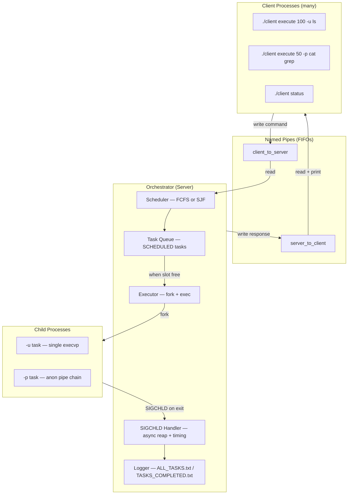
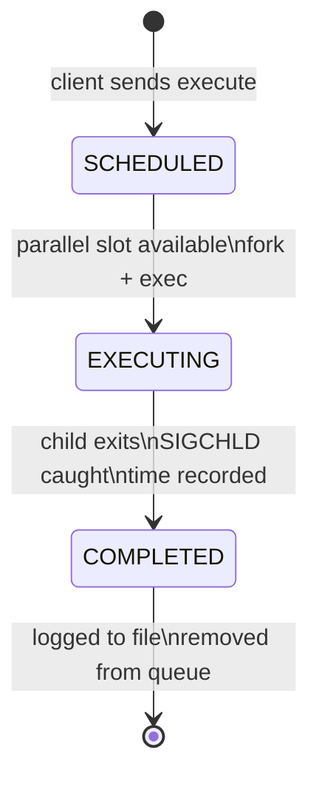
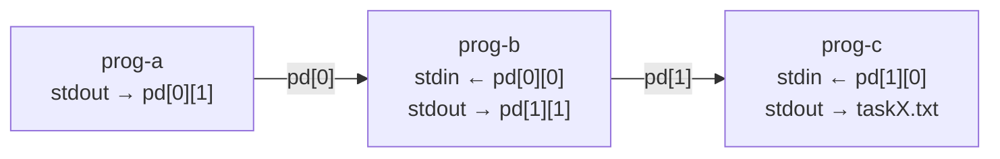

# Task Orchestrator

> A client-server task scheduling daemon written in C using POSIX primitives — featuring named pipe IPC, configurable scheduling policies (FCFS / SJF), parallel process execution, anonymous pipe chaining for multi-program pipelines, SIGCHLD-based async reaping, and millisecond-precision task timing.

---

## Overview

This project implements a **Unix task orchestrator**: a persistent server process (the *orchestrator*) that accepts task submissions from multiple concurrent client processes, schedules them according to a chosen policy, and executes them as isolated child processes — capturing their output to individual files and logging completion times.

The system is built entirely on raw POSIX system calls: no threads, no external libraries, no higher-level abstractions. IPC is handled via named FIFOs; multi-program pipelines are wired together with anonymous pipes and `dup2`; task lifecycle events are caught asynchronously via `SIGCHLD`.

---

## Architecture



---

## Task Lifecycle



---

## Key OS Concepts

| Concept | Where used |
|---|---|
| **Named pipes (FIFOs)** | Bidirectional client ↔ server IPC (`client_to_server`, `server_to_client`) |
| **Anonymous pipes** | Wiring stdout of one program to stdin of the next in `-p` pipeline tasks |
| **`fork` / `execvp`** | Each task runs in an isolated child process; programs are exec'd by name |
| **`dup2`** | Redirecting child stdout and stderr to per-task output files |
| **`SIGCHLD` + `waitpid(WNOHANG)`** | Non-blocking async reaping of completed children; avoids zombie processes |
| **`gettimeofday`** | Millisecond-precision wall-clock timing from task receipt to child exit |
| **`realloc`** | Dynamically growing the task array as new submissions arrive |
| **`O_APPEND`** | Race-safe appending to shared log files from multiple writers |
| **Scheduling (FCFS / SJF)** | In-place insertion into the task queue at submission time |

---

## Scheduling Policies

The orchestrator supports two policies, selected at startup:

**FCFS — First Come First Served**
Tasks are appended to the queue in arrival order. The oldest waiting task is always dispatched first when a parallel slot opens.

**SJF — Shortest Job First**
At submission time, the new task is inserted into the pending portion of the queue (after all currently executing tasks) in ascending order of its declared `expected_time`. When a slot opens, the shortest waiting task runs next. The expected time is provided by the client and acts as a preemption hint — this is a non-preemptive SJF implementation.

Both policies operate on the same dynamic array with `current_task` as a cursor separating executing from scheduled tasks.

---

## Pipeline Execution (`-p` flag)

When a task contains multiple programs separated by `|`, the orchestrator builds a chain of anonymous pipes and forks one child per program:



Each intermediate process reads from the previous pipe's read-end and writes to the next pipe's write-end. The final process in the chain writes to the task's dedicated output file. All stderr is redirected to the same output file throughout the chain.

---

## Project Structure

```
.
├── src/
│   ├── orchestrator.c     # Server: FIFO listener, scheduler, fork/exec, SIGCHLD handler
│   ├── client.c           # Client: writes command to FIFO, reads and prints response
│   └── utilities.c        # strdup_n (length-bounded dup), copy_args_prog (deep copy)
│
├── include/
│   ├── client.h           # POSIX headers (unistd, fcntl, signal, sys/wait, sys/time…)
│   └── utilities.h        # Declarations for utility functions
│
├── Makefile               # Builds orchestrator + client into bin/; copies pscript.sh
└── pscript.sh             # Stress-test script: fires 5 random tasks with random programs
```

---

## Building

```bash
make
```

Compiles both binaries with `gcc -Wall -g` into `bin/`. Clean with:

```bash
make clean
```

---

## Usage

### 1. Start the orchestrator

```bash
./orchestrator <output_folder> <parallel-tasks> <sched-policy>
```

| Argument | Description |
|---|---|
| `output_folder` | Directory where task output files and logs are written |
| `parallel-tasks` | Maximum number of tasks that may execute simultaneously |
| `sched-policy` | `FCFS` or `SJF` |

```bash
./orchestrator results 3 FCFS
```

The orchestrator creates `client_to_server` and `server_to_client` FIFOs in the working directory and blocks waiting for client connections.

### 2. Submit a single-program task (`-u`)

```bash
./client execute <expected_time> -u <program> [args...]
```

```bash
./client execute 200 -u ls -la
./client execute 50  -u sleep 3
```

### 3. Submit a pipeline task (`-p`)

```bash
./client execute <expected_time> -p <prog-a [args]> | <prog-b [args]> | ...
```

```bash
./client execute 100 -p cat /etc/passwd | grep root | wc -l
```

The `|` separators are parsed server-side; pass the full pipeline as a single quoted argument from the shell.

### 4. Query task status

```bash
./client status
```

Prints three sections — **Executing**, **Scheduled**, and **Completed** — with task IDs, program names, and elapsed times for completed tasks.

### 5. Shut down the orchestrator

```bash
./client end
```

Frees all allocated memory, removes the FIFOs, and exits cleanly.

### 6. Run the stress-test script

```bash
cd bin && ./pscript.sh
```

Fires 5 randomly generated tasks (random programs, random expected times, random `-u`/`-p` flags) to exercise the scheduler under load.

---

## Output Files

All output is written inside the `output_folder` specified at startup:

| File | Contents |
|---|---|
| `ALL_TASKS.txt` | One line per task completion: task ID and elapsed time in milliseconds |
| `TASKS_COMPLETED.txt` | Summary of completed tasks: task ID, program names, execution time |
| `TASK{N}.txt` | Captured stdout and stderr of task N |

---

## Author

Developed by **Gonçalo Oliveira Cruz** as part of the **Operating Systems** course at the [University of Minho](https://www.uminho.pt/), academic year 2024/25.